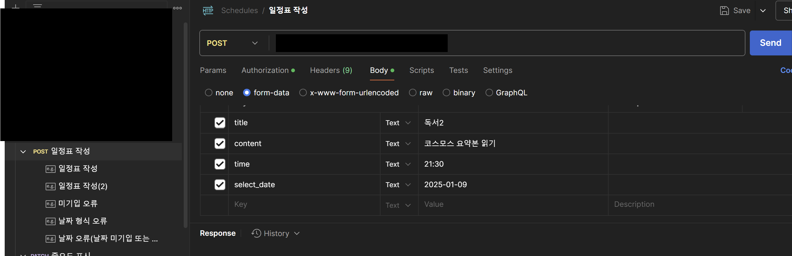
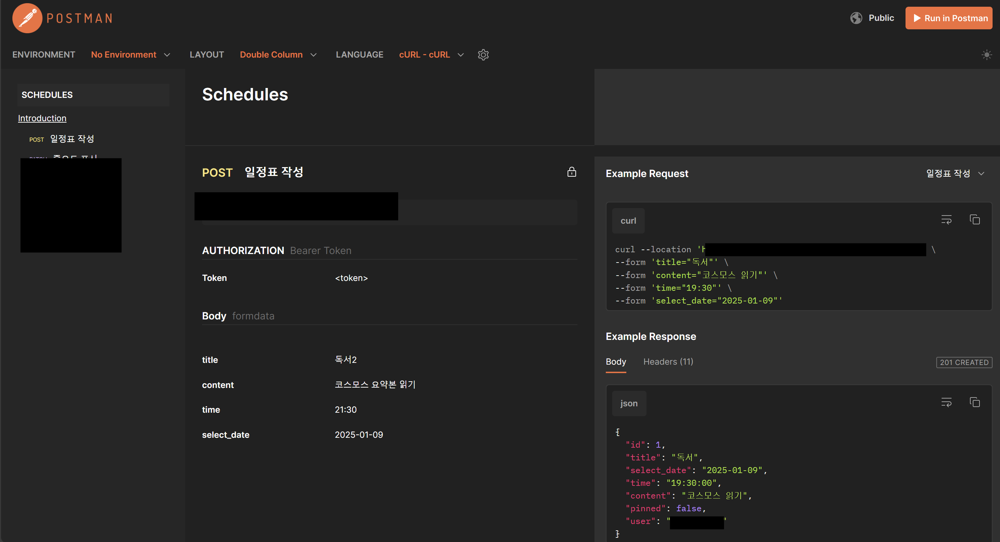

## Postman API 문서화

Postman은 API 문서를 자동 생성하고, 이를 공유하거나 게시할 수 있는 기능을 제공한다.

---

### API 문서서 작성하는 방법

**1. Postman 컬렉션(Collection) 생성**
Postman을 실행하고 왼쪽 사이드바에서 컬렉션을 생성한다.
- **"Create Collection"**을 클릭.
- 컬렉션 이름과 설명(선택 사항)을 입력한다.

**2. API 요청 추가 및 설명 작성**
- 컬렉션에 요청(Request)을 추가한다.
    - 컬렉션을 선택한 후 **"Add Request"**를 클릭한다.
    - API의 이름, URL, HTTP 메서드 등을 입력한다.
- 요청에 대한 세부 정보를 작성한다.
    - 요청의 "Pre-request Script", "Headers", "Body", "Tests" 섹션을 작성한다.
    - 요청 화면 아래의 "Description" 탭에서 요청에 대한 설명을 추가한다.
        - 요청이 하는 역할, 필요한 매개변수, 응답 예시 등을 명시한다.

**3. 문서화용 설명 추가**
- 컬렉션 이름을 클릭하고 **"Edit Collection"**을 선택한다.
- 컬렉션 설명에 다음 항목을 작성한다
    - API 소개: API의 역할과 목적.
    - 사용 방법: API 호출 방법 및 주의사항.
    - 인증 정보: 인증 방식 설명(예: API 키, OAuth).
    - 버전 관리: API 버전에 대한 정보.

**4. Example(예시) 추가**
- Postman은 요청과 응답 예시를 문서에 포함할 수 있다.
    - 요청 화면에서 "Save Example" 버튼을 클릭한다.
    - 예상되는 요청 및 응답 데이터를 작성한다.
    - 이를 통해 API 사용자에게 명확한 참고 자료를 제공할 수 있다.

**5. 자동 문서 생성**
- 컬렉션 공유 및 문서 생성
    - 컬렉션 이름 옆의 "•••" 메뉴를 클릭하고 **"View Documentation"**을 선택한다.
    - Postman이 자동으로 API 문서를 생성한한다.
- 문서 편집
    - 생성된 문서에서 컬렉션이나 요청의 설명을 편집할 수 있다.
- 웹 문서화
    - 상단의 "Publish" 버튼을 클릭하여 API 문서를 공개 URL로 게시하거나 팀과 공유할 수 있다.

**6. Postman 문서 공유**
- 문서가 준비되면 "Share Collection" 버튼을 눌러 팀원이나 외부 사용자와 공유한다.
    - 팀 공유: Postman 팀 공간을 통해 문서를 공유.
    - 외부 공유: URL 링크를 생성해 문서를 외부 사용자와 공유.

**7. 문서화의 Best Practice**
- 명확한 제목과 설명: 요청과 컬렉션 설명을 간결하게 작성.
- 매개변수와 응답 예시 제공: API 사용자가 혼동하지 않도록 상세히 기술.
- 에러 코드 설명: API의 에러 응답과 원인을 문서에 포함.

---
### 예제: 현재 작업에 대해 적용 사례

- published 이후

---
공부를 하면서, 기능들을 알아가는게 너무 좋았다.
Postman의 문서화 기능은 보다 편리하게 필요한 항목을 채워넣어, 손쉽게 문서를 완성할 수 있다는 점을 알 수 있다. 기존 작업에 대한 앞으로의 진행 중 및 다른 프로젝트를 할 때, 유용하게 사용하게겠다. 
